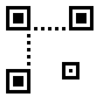

# Blank QR Code

I wanted a QR code with no information in it, so I could use it as a marker for automated texture application in video editing.
I couldn’t find one, so I created one, and here it is.

Blank QR Code by Sean Bradley is licensed under a [Creative Commons Attribution-ShareAlike 4.0 International License](https://creativecommons.org/licenses/by-sa/4.0/).

