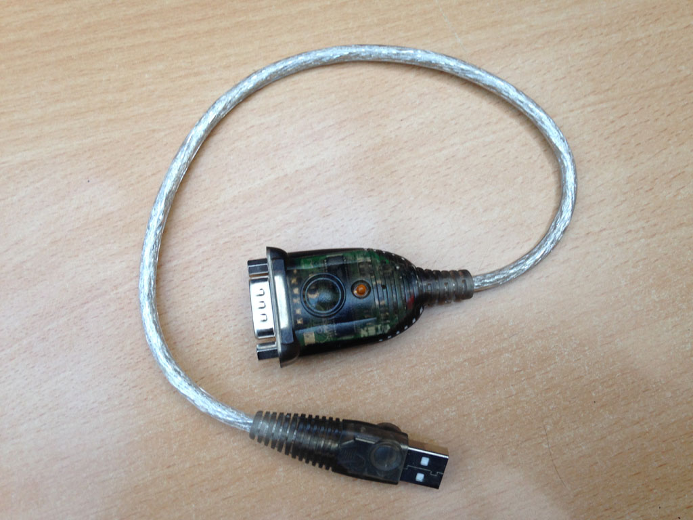
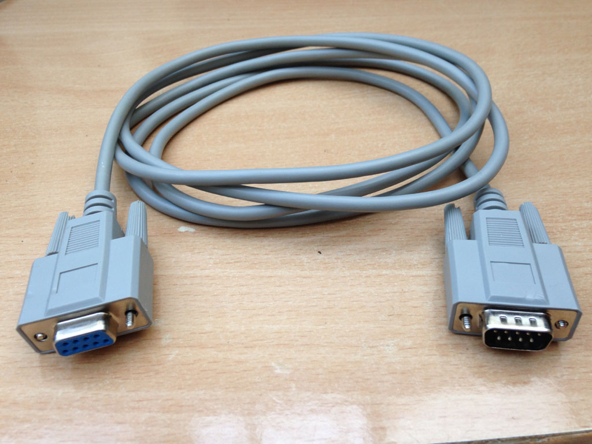
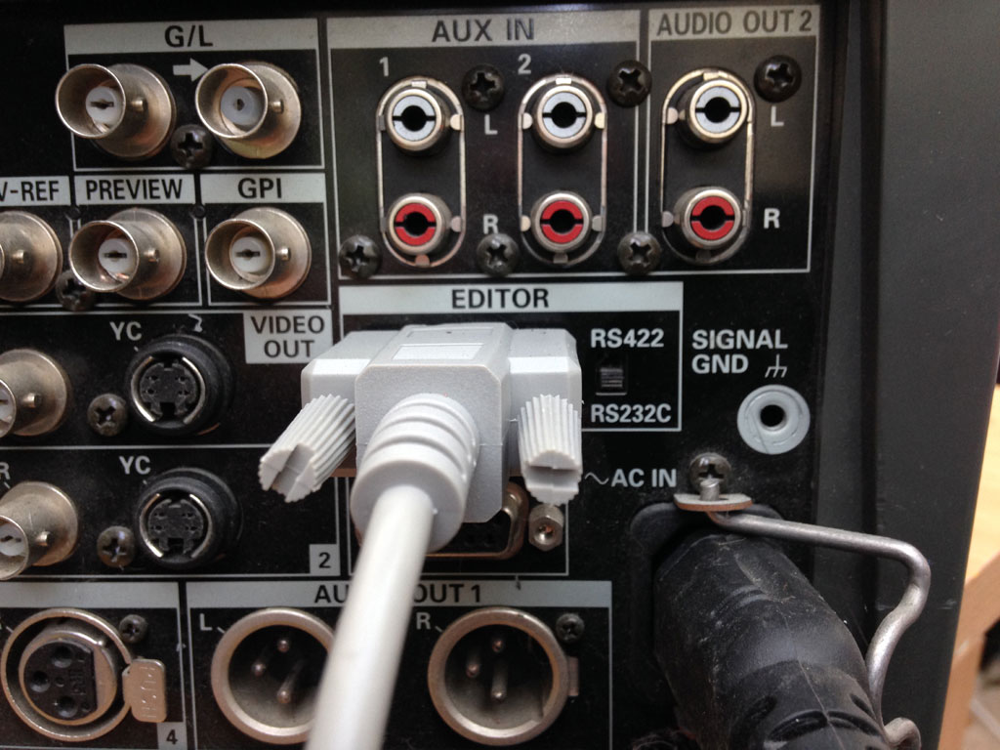
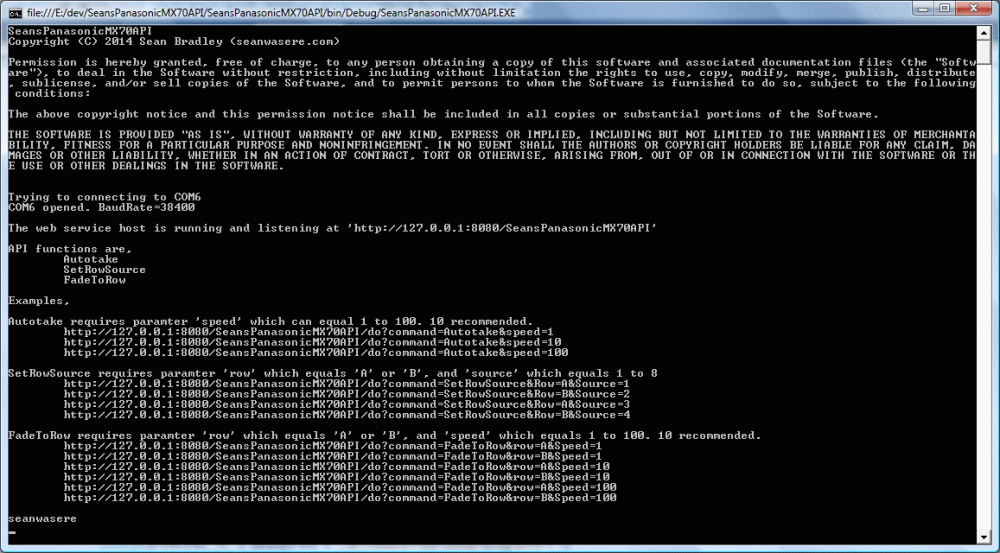

# Sean’s Panasonic MX-70 API

## Introduction

On this, page you can see how to automate aspects of the Panasonic MX-70 vision mixer desk.

## What you will need

If your pc doesn’t have a com port, you can purchase a DB9 USB to Serial adapter. 

Plug into PC, install drivers and take note of which com port it has been assigned in the windows Device Manager.



You will also need a serial extension lead, since the adapter cable is to small. 

Don’t buy a ‘Null Modem’ cable by accident. This will not work. I made that mistake already.



Plug the extension cable into the USB Serial adapter. Then the other end into the back of the MX-70 vision mixer.

Switch to the RS232C option as visible in the picture.



## Using the API

Visit and get the code from my project [GitHub page](https://github.com/Sean-Bradley/SeansPanasonicMX70API)

Download and compile using Visual Studio.

It requires .Net4.0 runtime to run.

In the config file, set the set the com port to the com port your computer has assigned to the USB Serial adapter. On my PC, it was COM6.

```xml
<?xml version="1.0"?>
<configuration>
 <appSettings>
 <add key="ComPort" value="COM6"/>
 <add key="APIURI" value="http://127.0.0.1:8080/SeansPanasonicMX70API" />
 </appSettings>
</configuration>
```

Start the **SeansPanasonicMX70API.exe** as an **Administrator**.

If all is fine you should see a screen similar to below.



Start the MX-70 vision mixer hardware.

## API Calls

Enter the API calls into the browser address bar, or use any other method you prefer that can send http messages.

The available functions are,

- Autotake

- SetRowSource

- FadeToRow

**Autotake** requires parameter ‘speed’ which can equal 1 to 100. 10 recommended.

```
http://127.0.0.1:8080/SeansPanasonicMX70API/do?command=Autotake&speed=1

http://127.0.0.1:8080/SeansPanasonicMX70API/do?command=Autotake&speed=10

http://127.0.0.1:8080/SeansPanasonicMX70API/do?command=Autotake&speed=100
```

**SetRowSource** requires parameter ‘row’ which equals ‘A’ or ‘B’, and ‘source’ which equals 1 to 8

```
http://127.0.0.1:8080/SeansPanasonicMX70API/do?command=SetRowSource&Row=A&Source=1

http://127.0.0.1:8080/SeansPanasonicMX70API/do?command=SetRowSource&Row=B&Source=2

http://127.0.0.1:8080/SeansPanasonicMX70API/do?command=SetRowSource&Row=A&Source=3

http://127.0.0.1:8080/SeansPanasonicMX70API/do?command=SetRowSource&Row=B&Source=4
```

**FadeToRow** requires parameter ‘row’ which equals ‘A’ or ‘B’, and ‘speed’ which equals 1 to 100. 10 recommended.

```
http://127.0.0.1:8080/SeansPanasonicMX70API/do?command=FadeToRow&row=A&Speed=1

http://127.0.0.1:8080/SeansPanasonicMX70API/do?command=FadeToRow&row=B&Speed=1

http://127.0.0.1:8080/SeansPanasonicMX70API/do?command=FadeToRow&row=A&Speed=10

http://127.0.0.1:8080/SeansPanasonicMX70API/do?command=FadeToRow&row=B&Speed=10

http://127.0.0.1:8080/SeansPanasonicMX70API/do?command=FadeToRow&row=A&Speed=100

http://127.0.0.1:8080/SeansPanasonicMX70API/do?command=FadeToRow&row=B&Speed=100
```

## A Video Demonstration of the API being used to contreol the MX-70 vision mixer

[](https://www.youtube.com/watch?v=winqdEXxyhQ)

[Sean’s Panasonic MX-70 API](https://www.youtube.com/watch?v=winqdEXxyhQ)


