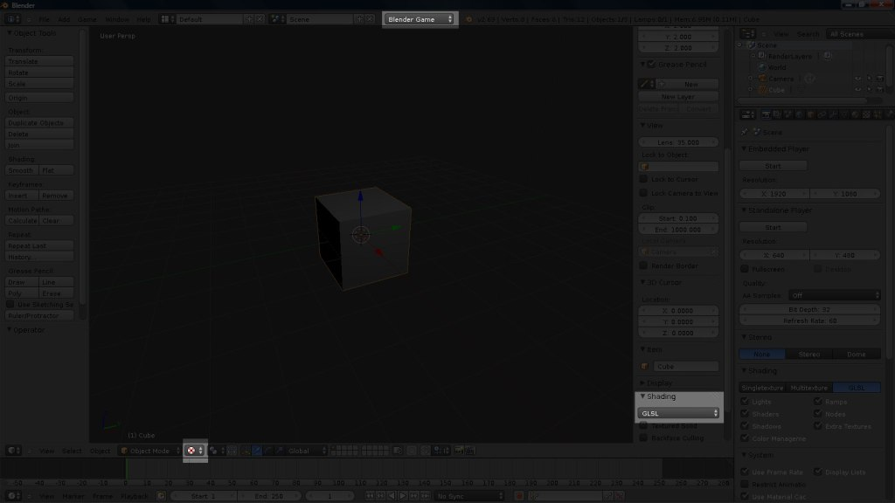
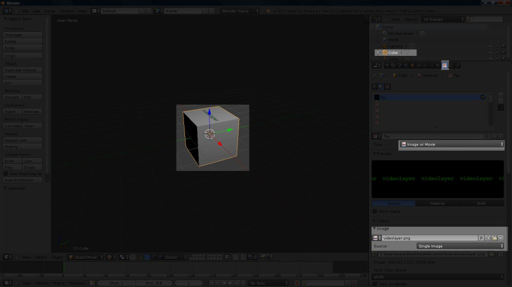
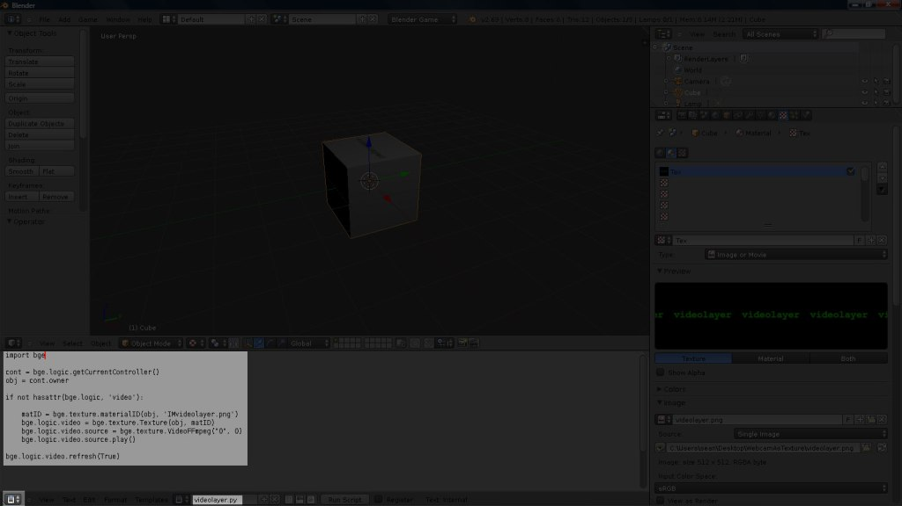
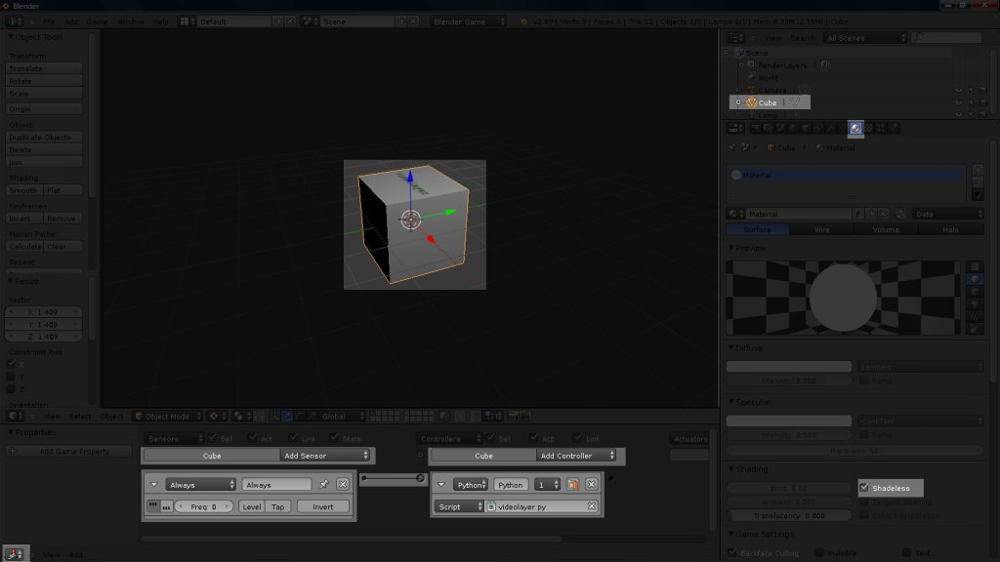

# Webcam As Texture in Blender Game Engine

## Introduction
This quick tutorial shows how to use a webcam (aka video and audio input device) as a texture in the Blender Game Engine on Windows.
The Blender version I used was 2.69.

## Background
I searched for quite a while to figure out this one and can see many people also having problems with it.
So that’s why I created this tutorial since a webcam as a texture is a very cool thing.

## Prerequisites
A webcam, windows and blender 2.69

## Instructions
1. Open blender in default settings, and choose **Blender Game**, **GLSL Shading** and **Texture** mode.



2. Select the default cube.

Go to it’s texture editor, choose **Image or Movie** as type.

Copy the png below and open it in blender. The filename should remain **videolayer.png**.




3. Create a new text file using the text editor in blender and name it **videolayer.py**.

Copy paste the python code below.

```python
import bge
cont = bge.logic.getCurrentController()
obj = cont.owner
if not hasattr(bge.logic, 'video'):
    matID = bge.texture.materialID(obj, 'IMvideolayer.png')
    bge.logic.video = bge.texture.Texture(obj, matID)
    bge.logic.video.source = bge.texture.VideoFFmpeg("0", 0) 
    bge.logic.video.source.play()
bge.logic.video.refresh(True)
```

The code above references the png that was opened in step 2. **videolayer.png**



4. Select the cube again.

Open the node editor.

Create a new **Always** sensor.

Select **TRUE** triggering on the **Always** sensor

Create a new **Python** controller.

Choose the **videolayer.py** script in the **Python** Controller.

Link them together.



5. Select **Game->Start Game Engine** or put mouse in viewport and press **P** to see it work.

## Source Files
Visit my [GitHub project page](https://github.com/Sean-Bradley/Webcam-As-Texture-in-Blender) to download this project. 

Note that it works best in blender 2.69.

You can also watch this tutorial on youtube.

[](https://www.youtube.com/watch?v=lwi-2nXH3vc)

[Webcam As Texture in Blender Game Engine](https://www.youtube.com/watch?v=lwi-2nXH3vc)


